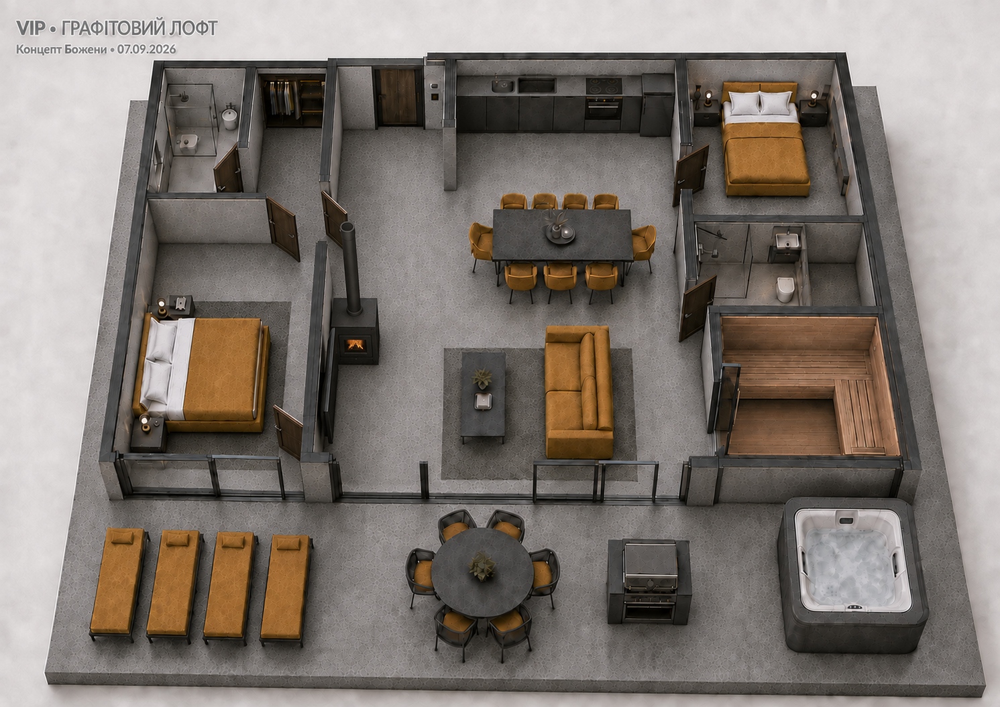

# VIP-вілла — затверджена концепція будинку

**Проєкт:** White.Lev.Travel · «Білий Лев»
**Дата оновлення:** 08.09.2026
**Спирається на:** погоджений власниками варіант 24 від 07.09.2026.
**Статус:** основна затверджена концепція VIP; основа для архітектурного проєкту.

## Візуальний еталон

Актуальний перегляд: [14_vip_plan.html](14_vip_plan.html). Варіант `24_vip_access_final.png` — погоджений вихідний кадр. Ітерації 20–23 архівні. Файл 14 тепер показує цей об’ємний концепт, а не попередню розмірну схему.

## Стиль та оснащення

Графітовий лофт; гірчичні м’які меблі та білі подушки; 2 спальні, 2 санвузли, гардероб; камін зліва й телевізор навпроти дивана; кухня без острова; збільшена сауна; джакузі на терасі, круглий стіл і 4 лежаки; скляні виходи на терасу зі спальні та вітальні.

Гірчичними є оббивка дивана, крісел, ліжок, подушки лежаків і терасних крісел та покривала. Подушки на обох ліжках білосніжні; бірюза виключена. Корпусні меблі, столи й металеві деталі графітні; стіни та підлога сірі, у стилі лофт. Брендова палітра логотипа лишається чорно-білою.

## Планування та маршрути

| Зона | Затверджене рішення |
|---|---|
| Хол | Вхід до будинку, доступ до гардероба та вітальні. |
| Майстер-спальня | Вхід із вітальні, доступ до гардероба, окремий скляний вихід на терасу. Зайву окрему шафу прибрано. |
| Гардероб | Доступ із холу та майстер-спальні; двері до приватного санвузла. |
| Майстер-санвузол | Душ, WC, умивальник; доступ через гардероб. Внутрішнє джакузі не входить у затверджений варіант. |
| Друга спальня | Незалежний вхід із вітальні, не через майстер-блок. |
| Кухня-їдальня | Лінійна кухня без острова з посадкою; окремий обідній стіл у центрі. |
| Вітальня | Камін біля лівої перегородки, диван до нього, журнальний столик між ними; телевізор поруч на стіні навпроти дивана. Окремий скляний вихід на терасу. |
| Гостьовий санвузол | Душ, WC, умивальник; розширення до правої зовнішньої стіни за рахунок порожньої смуги; вхід із вітальні. |
| Сауна | Розширена вліво замість ніші; ліва стіна вирівняна зі стіною гостьового санвузла; вхід із вітальні. |
| Тераса | Джакузі замість чана, барбекю, круглий стіл, рівно 4 лежаки. |

## Габарити, інженерія й економіка

Попередні орієнтири: будинок ≈85–100 м², тераса ≈30–40 м². Це гіпотези, а не обміри затвердженого кадру. Старі площі окремих приміщень і габарити не переносити як перевірені: санвузол і сауна змінилися.

Архітектор деталізує прорізи, ширини проходів, перегородки, скління, димохід і відступ телевізора від нагріву, вентиляцію сауни, водопостачання й опору під джакузі. Зовнішній контур і посадка на ділянці концептуально збережені; точність перевіряється на плані та топозйомці. Візуалізація не є робочим кресленням.

Попередні бюджет, ціна продажу та дохідність залишаються гіпотезами фінмоделі. Нове оснащення потребує уточненого кошторису; погодження дизайну не підтверджує ці суми.

## Пріоритет

Ця специфікація та погоджений кадр є основою всіх матеріалів VIP. Попередні описи чана, кухонного острова, внутрішнього джакузі, бірюзової оббивки й меншої сауни для VIP втратили актуальність.
